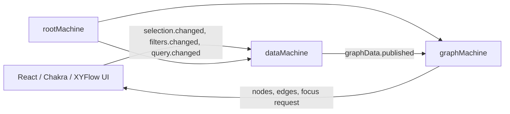

# S2 visualizer architecture

`S2Visualizer` is a React/Chakra UI around a small XState actor system. The UI
does not derive graph data or positions itself: it reads machine context and
sends intent events only.

## Actor topology

The root starts `dataMachine` and `graphMachine`. It injects the graph actor
reference into `dataMachine`, so graph-data publication does not require a
separate routing actor.

## End-to-end sequence

1. `dataMachine` invokes `fetchingData` to fetch source records, then stores them, applies filters, and derives `graphData` through named machine actions.
2. It publishes `graphData.changed` directly to `graphMachine` as
   `graphData.published`.
3. `graphMachine` stores that payload as `latestGraphData` and recalculates
   itself directly.
4. Its ordered actions calculate
   layout, then create XYFlow `nodes`/`edges` and update selection/focus state.
5. `index.tsx` renders those elements. Its focus controller observes
   `focusRequest` and fits the relationship frame in the XYFlow viewport.

## Machines and context

### `rootMachine`

Owns the long-lived actor references and controls startup order.

| Context key | Used for |
| --- | --- |
| `graph` | Reference passed to `dataMachine` so it can publish graph-data changes. |
| `data` | Reference consumed by `useDataActor` and by UI intent handlers. |
| `graph` | Reference consumed by `useGraphActor`; owns graph layout and XYFlow state. |

Input: `theme?: "light" | "dark"`. It is reserved for root-level theming; the
visualizer currently renders with the light theme.

### `dataMachine`

Owns all source data, selection/filter state, and the graph payload that is
published for rendering. Components must not recreate this data logic.

| Context key | Used for |
| --- | --- |
| `rawTokenData` | Unfiltered records returned by `fetchingData`; retained so filter changes rebuild locally without another network request. |
| `completeGraph` | Complete graph for the active token-set filters; used for selection traversal, search, and display-graph derivation. |
| `graphData` | Graph data projection: persistent roots plus the selected nodes' upstream/downstream relationships. Published to the broker. |
| `components` | Component names returned while loading; available for component-oriented controls. |
| `filters` | Active token-set filters; a change reloads `completeGraph`. |
| `selected` | Ordered IDs selected by the user; drives display graph, tags, styling, and focus. |
| `selectionItems` | Selected nodes normalized for display, sorted with components first; used by the selected-tags UI. |
| `related` | Downstream closure of `selected`; used to style related nodes and paths. |
| `focusNodeIds` | Relationship frame for automatic XYFlow fitting: selected parent(s) and downstream children, or selected/upstream context if no children exist. |
| `query` | Current search input. |
| `matches` | Up to eight matching graph nodes for the search popover. |
| `error` | Load failure message shown by the UI. |
| `graph` | Graph actor reference used to publish `graphData.changed`. |

The initial `fetching` state invokes `fetchingData`, which fetches source
records only. On completion, the machine runs these actions in order:
`storeFetchedData`, `buildGraphFromData`, `reconcileSelectionData`,
`deriveSelectionData`, `deriveSearchMatches`, and
`notifyFilteredDataChanged`.

Selection changes use `captureSelectionChange`, `deriveSelectionData`, and
`notifySelectionChanged`; clearing selection uses the same derived-data and
notification path. Filter changes use `captureFilterCriteria` and rebuild from
cached `rawTokenData`, rather than fetching again.

### `graphMachine`

Owns both graph positioning and XYFlow/render lifecycle. It subscribes to
direct `graphData.published` messages. On publication,
`calculateGraphLayout` runs before `createGraphFlow`, so XYFlow elements are
always built from the positioned graph.

| Context key | Used for |
| --- | --- |
| `graph` | Latest positioned graph after deterministic column/row layout. |
| `latestGraphData` | Most recently received unpositioned graph-data payload; available for inspection/debugging. |
| `nodes` | XYFlow node array rendered by `ReactFlow`. |
| `edges` | XYFlow edge array rendered by `ReactFlow`; styling reflects selection data. |
| `viewport` | Last XYFlow pan/zoom state, updated after a user move. |
| `selected` | Selected IDs used when creating selected node and edge styles. |
| `related` | Related IDs used when creating descendant/path node styles. |
| `focusNodeIds` | IDs considered by the XYFlow focus controller. |
| `focusRequest` | Monotonic token incremented after a layout result; triggers one automatic fit/zoom. |
| `error` | Reserved visualizer-level error state. |

`calculateGraphLayout` clones and lays out graph data. `createGraphFlow` then
updates selection metadata, XYFlow nodes, XYFlow edges, and `focusRequest`.
Keeping them ordered in the same transition prevents selection styles and
auto-fit from using different graph revisions.

## UI boundary

`index.tsx` sends only intent events (`selection.changed`, `filters.changed`,
`query.changed`, viewport/node-movement events) and reads derived state through
the actor hooks. `SpectrumTokenNode` is a memoized XYFlow node renderer; it has
no graph traversal, filtering, selection, or layout responsibility.
