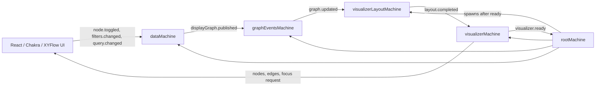

# S2 visualizer architecture

`S2Visualizer` is a React/Chakra UI around a small XState actor system. The UI
does not derive graph data or positions itself: it reads machine context and
sends intent events only.

## Actor topology

The root starts `graphEventsMachine`, `dataMachine`, and `visualizerMachine`.
`visualizerMachine` announces `visualizer.ready`; only then does the root spawn
`visualizerLayoutMachine`. This gives the layout actor a stable visualizer actor
reference before it can publish a layout result.

## End-to-end sequence

1. `dataMachine` loads the filtered token graph and creates `displayGraph`.
2. It publishes `displayGraph.changed` to `graphEventsMachine`.
3. `graphEventsMachine` stores that payload as `latest` and broadcasts
   `graph.updated` to every subscriber. It replays `latest` to subscribers that
   arrive later, including the layout machine created after visualizer readiness.
4. `visualizerLayoutMachine` receives `graph.updated`. Its
   `calculateAndPublish` enqueue action sorts roots, traverses adjacency,
   assigns columns/rows, aligns child layers with incoming edges, then updates
   its own context.
5. The same enqueue action sends `layout.completed` to `visualizerMachine`.
6. `visualizerMachine` atomically stores the positioned graph and selection
   metadata, creates XYFlow `nodes`/`edges`, and increments `focusRequest`.
7. `index.tsx` renders those elements. Its focus controller observes
   `focusRequest` and fits the relationship frame in the XYFlow viewport.

## Machines and context

### `rootMachine`

Owns the long-lived actor references and controls startup order.

| Context key | Used for |
| --- | --- |
| `graphEvents` | Reference to the event broker shared by data and layout actors. |
| `data` | Reference consumed by `useDataActor` and by UI intent handlers. |
| `visualizer` | Reference consumed by `useVisualizerActor`; receives layout results. |
| `visualizerLayout` | Reference to the root-spawned layout actor; `null` until `visualizer.ready`. |

Input: `theme?: "light" | "dark"`. It is reserved for root-level theming; the
visualizer currently renders with the light theme.

### `dataMachine`

Owns all source data, selection/filter state, and the graph payload that is
published for rendering. Components must not recreate this data logic.

| Context key | Used for |
| --- | --- |
| `completeGraph` | Complete graph for the active token-set filters; used for selection traversal, search, and display-graph derivation. |
| `displayGraph` | Minimal graph to render: persistent roots plus the selected nodes' upstream/downstream relationships. Published to the broker. |
| `components` | Component names returned while loading; available for component-oriented controls. |
| `filters` | Active token-set filters; a change reloads `completeGraph`. |
| `selected` | Ordered IDs selected by the user; drives display graph, tags, styling, and focus. |
| `selectionItems` | Selected nodes normalized for display, sorted with components first; used by the selected-tags UI. |
| `related` | Downstream closure of `selected`; used to style related nodes and paths. |
| `focusNodeIds` | Relationship frame for automatic XYFlow fitting: selected parent(s) and downstream children, or selected/upstream context if no children exist. |
| `query` | Current search input. |
| `matches` | Up to eight matching graph nodes for the search popover. |
| `error` | Load failure message shown by the UI. |
| `graphEvents` | Broker actor reference used to publish `displayGraph.changed`. |

### `graphEventsMachine`

An event broker. It prevents data and layout actors from directly depending on
each other, and lets future actors subscribe to graph updates.

| Context key | Used for |
| --- | --- |
| `latest` | Most recently published display-graph payload; replayed to a late subscriber. |
| `subscribers` | Actor references that requested `displayGraph.subscribed`; each receives `graph.updated`. |

`publish` and `subscribe` use `enqueueActions` so state updates and fan-out
messages are part of one machine transition.

### `visualizerLayoutMachine`

Owns graph positioning. It is spawned by the root after the visualizer becomes
ready and subscribes to `graphEventsMachine`.

| Context key | Used for |
| --- | --- |
| `visualizer` | Target actor reference for `layout.completed`. |
| `graphEvents` | Broker actor reference used to subscribe to `graph.updated`. |
| `graph` | Latest positioned graph produced by the layout computation. |
| `selected` | Selection metadata forwarded with the layout result. |
| `related` | Related-node metadata forwarded with the layout result. |
| `focusNodeIds` | Viewport focus metadata forwarded with the layout result. |
| `error` | Reserved for layout failures; current synchronous layout path clears it after a successful calculation. |

`calculateAndPublish` is the authoritative layout operation. It:

1. clones the input graph so data state is never mutated;
2. sorts root nodes and adjacency lists for deterministic order;
3. calculates layer/row positions and valid assignments;
4. aligns each child layer to the centroid of its actual incoming edges;
5. calculates graph dimensions;
6. enqueues a context update and sends the complete result to the visualizer.

### `visualizerMachine`

Owns render-ready graph state and user-controlled viewport/node movement. It
does not calculate data relationships or layout positions.

| Context key | Used for |
| --- | --- |
| `graph` | Latest positioned graph returned by `visualizerLayoutMachine`. |
| `nodes` | XYFlow node array rendered by `ReactFlow`. |
| `edges` | XYFlow edge array rendered by `ReactFlow`; styling reflects selection data. |
| `viewport` | Last XYFlow pan/zoom state, updated after a user move. |
| `selected` | Selected IDs used when creating selected node and edge styles. |
| `related` | Related IDs used when creating descendant/path node styles. |
| `focusNodeIds` | IDs considered by the XYFlow focus controller. |
| `focusRequest` | Monotonic token incremented after a layout result; triggers one automatic fit/zoom. |
| `error` | Reserved visualizer-level error state. |

On `layout.completed`, `applyLayout` updates `graph`, selection metadata,
XYFlow nodes, XYFlow edges, and `focusRequest` together. Keeping that update
atomic is important: otherwise selection colors and auto-fit can render from
different graph revisions.

## UI boundary

`index.tsx` sends only intent events (`node.toggled`, `filters.changed`,
`query.changed`, viewport/node-movement events) and reads derived state through
the actor hooks. `SpectrumTokenNode` is a memoized XYFlow node renderer; it has
no graph traversal, filtering, selection, or layout responsibility.
