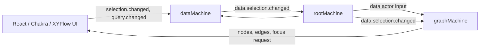

# S2 visualizer architecture

`S2Visualizer` is a React/Chakra UI around a small XState actor system. The UI
does not derive graph data or positions itself: it reads machine context and
sends intent events only.

## Actor topology

The root starts `dataMachine` first, then injects that actor into
`graphMachine`. Data notifies its parent after a selection change; the root
forwards that notification to graph. Graph reads the latest data snapshot
directly, rather than receiving copied graph or selection payloads.

## End-to-end sequence

1. `dataMachine` takes the local `components`, `orphanes`, `tokens`, and
   `relations` store arrays, builds `graphAll`, and derives selection/search
   state through named machine actions.
2. On selection changes, it sends `data.selection.changed` to `rootMachine`.
3. Root forwards that event to `graphMachine`, which reads the latest data
   snapshot, derives the display projection, and lays it out.
4. Its ordered actions calculate
   layout, then create XYFlow `nodes`/`edges` and update selection/focus state.
5. `index.tsx` renders those elements. Its focus controller observes
   `focusRequest` and fits the relationship frame in the XYFlow viewport.

## Machines and context

### `rootMachine`

Owns the long-lived actor references and controls startup order.

| Context key | Used for |
| --- | --- |
| `graph` | Reference passed to `dataMachine` so it can publish graph-data changes. |
| `data` | Reference consumed by `useDataActor` and by UI intent handlers. |
| `graph` | Reference consumed by `useGraphActor`; owns graph layout and XYFlow state. |

Input: `theme?: "light" | "dark"`. It is reserved for root-level theming; the
visualizer currently renders with the light theme.

### `dataMachine`

Owns all local source data, selection state, and the graph payload that is
published for rendering. Components must not recreate this data logic.

| Context key | Used for |
| --- | --- |
| `components` | Component IDs imported from the local store. |
| `orphanes` | Orphan-category IDs imported from the local store. |
| `tokens` | Token IDs imported from the local store. |
| `relations` | Flattened local relation records (`from`, `to`, optional `value`). |
| `graphAll` | Complete graph built from the four local source arrays; used for traversal, search, metadata, and display-graph derivation. |
| `selected` | Ordered IDs selected by the user; drives display graph, tags, styling, and focus. |
| `selectionItems` | Selected nodes normalized for display, sorted with components first; used by the selected-tags UI. |
| `focusNodeIds` | Relationship frame for automatic XYFlow fitting: selected parent(s) and downstream children, or selected/upstream context if no children exist. |
| `query` | Current search input. |
| `matches` | Up to eight matching graph nodes for the search popover. |

On entry, the ready state runs `buildGraphAll`, `deriveSelectionData`,
`deriveSearchMatches`, and `notifyParentOfSelectionChange`.

Selection changes use `captureSelectionChange`, `deriveSelectionData`, and
`notifyParentOfSelectionChange`; clearing selection uses the same derived-data
and notification path.

### `graphMachine`

Owns graph-data projection, graph positioning, and XYFlow/render lifecycle. On
the parent-routed `data.selection.changed` event, it reads its data actor input,
derives graph data, lays it out, then creates XYFlow elements.

| Context key | Used for |
| --- | --- |
| `data` | Data actor input; read on graph refresh to obtain the latest source and selection state. |
| `nodes` | XYFlow node array rendered by `ReactFlow`. |
| `edges` | XYFlow edge array rendered by `ReactFlow`; styling reflects selection data. |
| `viewport` | Last XYFlow pan/zoom state, updated after a user move. |
| `selected` | Selected IDs used when creating selected node and edge styles. |
| `focusRequest` | Monotonic token incremented after a layout result; triggers one automatic fit/zoom. |
| `error` | Reserved visualizer-level error state. |

`refreshGraphFlow` creates the display projection from the data actor snapshot,
lays it out locally, and immediately builds XYFlow nodes, edges, and
`focusRequest`. The intermediate graph is not retained in machine context.
Keeping them ordered in the same transition prevents selection styles and
auto-fit from using different graph revisions.

## UI boundary

`index.tsx` sends only intent events (`selection.changed`, `query.changed`,
viewport/node-movement events) and reads derived state through
the actor hooks. `SpectrumTokenNode` is a memoized XYFlow node renderer; it has
no graph traversal, filtering, selection, or layout responsibility.
